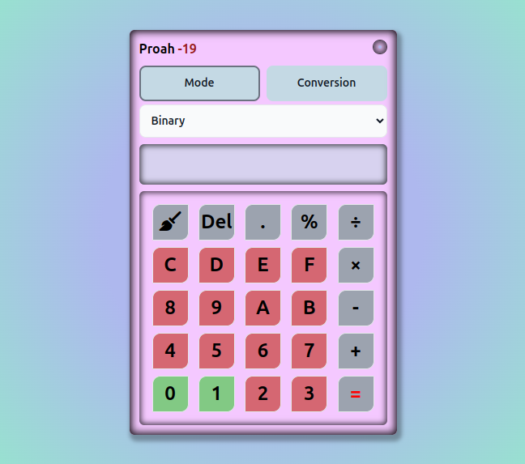

<h1 align="center">Bi Calculator<h1>

  

## Why did I create this?

I had created this calculator for improving my `Number System Knowledge` in JavaScript.

## Features:

In this calculator i had included total `4` Modes:

1. Binary
2. Octal
3. Decimal
4. Hexadecimal

That means, we can calculate any arithmetic operation with This Number System. and also i had included `Number Conversion` Features in this calclator. You can convert Any `Numbers` betwen this `4` Modes.

**Conversion Mode:**

1. Binary

   - Binary to Octal
   - Binary to Decimal
   - Binary to Hexadecimal

2. Octal

   - Octal to Binary
   - Octal to Decimal
   - Octal to Hexadecimal

3. Decimal

   - Decimal to Binary
   - Decimal to Octal
   - Decimal to Hexadecimal

4. Hexadecimal
   - Hexadecimal to Binary
   - Hexadecimal to Octal
   - Hexadecimal to Decimal

**Resources: That i have been following**

1. [https://github.com/NasaHack/Number-System](https://github.com/NasaHack/Number-System)
2. [https://github.com/NasaHack/play-with-numbers](https://github.com/NasaHack/play-with-numbers)

## Technology: That i Used

- **HTML**, **TailwindCSS**, **JavaScript**
- **Redux**
